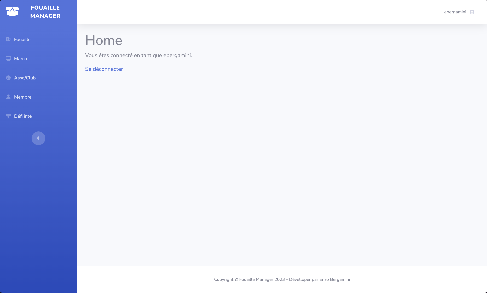
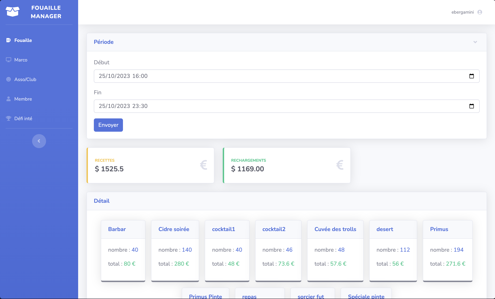
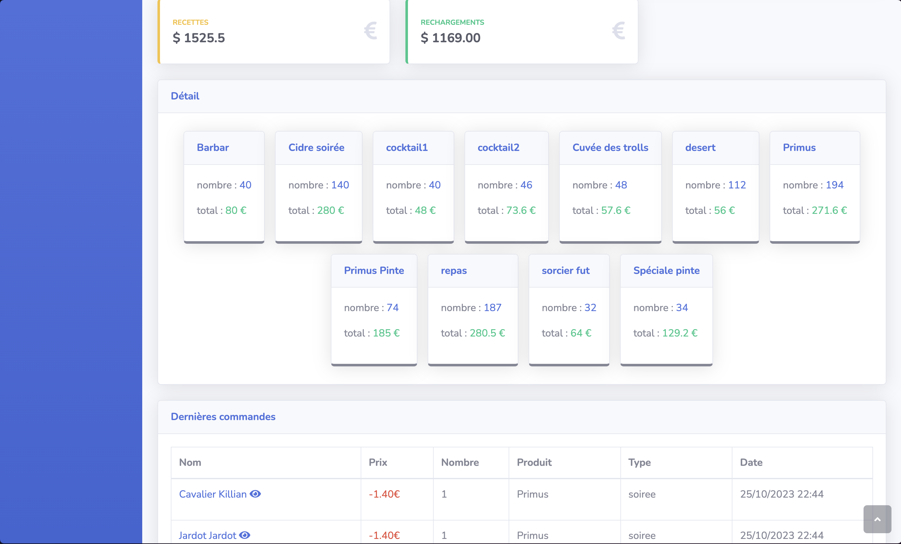
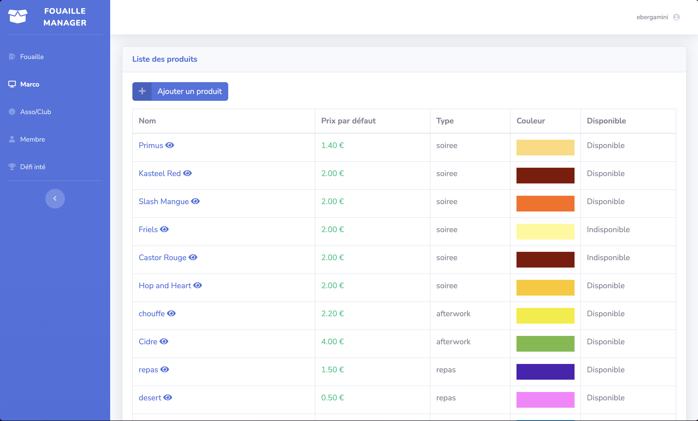
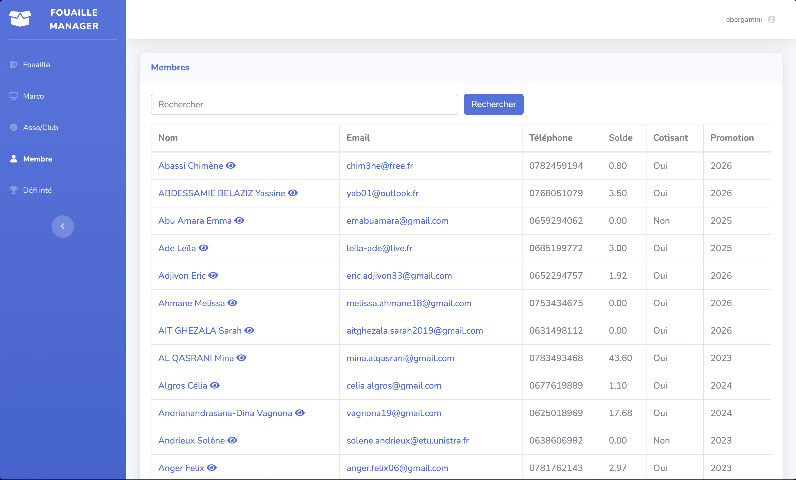

# Fouaille Manager

Fouaille Manager est une application web de gestion au profit du Bureau Des élèves (BDE) de Télécom Physique Strasbourg. Elle visent à simplifier la gestion des comptes fouaille (Appelation du foyer étudiant) des cotisant au BDE ainsi que toutes les données des membres.

## Features

- Connection des membres du BDE via leur compte de l'école (CAS Unistra)

- Détails sur les consommmations des cotisants
- Gestion des comptes des cotisant et de leurs donneés (modification)
- Gestion des Associations et Clubs de l'école (modification, ajout, suppression)
- Gestion des produits vendus au foyer (modification, ajout)

## Installation

- Clone the repo 
- Install the dependencies with `composer install`
- Create a `.env` file and add your database credentials and cas id for authentification (see `.env.example` file)
- Generate an app encryption key `php artisan key:generate`
- Run `php artisan migrate`
- Run `php artisan serve` for a dev server. Navigate to `http://localhost:8000/.

## Captures d'écran

### Home

### Fouaille

### Marco

## Membres 

